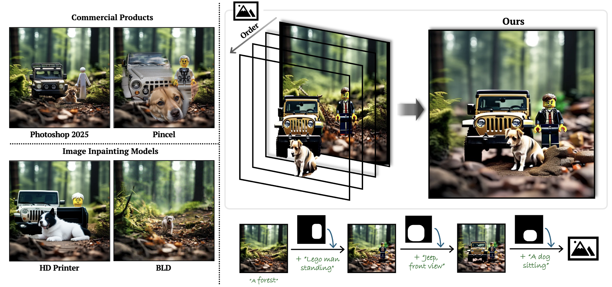

# Improving Editability in Image Generation with Layer-wise Memory  

<p align="center">
  
  <br/>
  <em>CVPR 2025</em>
</p>

## 🔥 Latest News 
- Sep 12th, 2025 Code released on GitHub!
- Sep 4th, 2025 Dataset released on GitHub!
- May 5th, 2025 Paper released on arXiv!
- Feb. 26th, 2025 Paper accepted to CVPR 2025!

## TODOs
- [x] Paper release
- [x] Benchmark dataset release 
- [x] Code release   
- [ ] Extended benchmark dataset & result release  

## Overview
This repository provides the official implementation for the CVPR 2025 paper "Improving Editability in Image Generation with Layer-wise Memory." The method enhances editability in image generation using a layer-wise memory approach integrated with the PixArt-alpha pipeline. The code includes an interactive Gradio demo for inpainting and evaluation scripts using CLIP and LLAVA metrics on a multi-edit benchmark dataset.

Key features:
- Layer-wise inpainting with custom memory for improved object editing.
- Support for cross-attention masking and multi-query disentanglement.
- Evaluation on a custom benchmark with metrics like CLIP score, BLEU, METEOR, and ROUGE.

## Installation

### Prerequisites
- Python 3.8 or higher
- CUDA-enabled GPU (for faster inference and evaluation)
- Git

### Setup
1. Clone the repository:
   ```bash
   git clone https://github.com/carpedkm/improving-editability.git
   cd improving-editability
   ```

2. Create and activate a virtual environment (recommended):
   ```bash
    conda create -n editability python=3.12 -y
    conda activate editability
   ```

3. Install dependencies from `requirements.txt`:
   ```bash
   pip install -r requirements.txt
   ```

4. Install custom dependencies:
   - Diffusers (from custom fork):
     ```bash
     cd diffusers
     pip install -e .
     cd ..
     ```
   - CLIP (from OpenAI):
     ```bash
     pip install "git+https://github.com/openai/CLIP.git@dcba3cb2e2827b4022701e7e1c7d9fed8a20ef1"
     ```

5. Download the benchmark dataset (`multi_edit_bench_original_100.json`) and place it in the root directory or specify its path via command-line arguments.

## Usage

### Interactive Demo (`demo.py`)
Launch the Gradio interface for interactive inpainting:
```bash
python app/demo.py --GPU_IDX 0 --result_dir ./output
```
- **Interface Overview**:
  - Input a prompt, draw a mask on the sketchpad, and optionally provide an initial image.
  - Adjust parameters like scheduler, guidance scales, vanilla ratio, and more via sliders and dropdowns.
  - Click "Generate" to produce the output image.
- Example: Generate an image with "A red apple on a table" as prompt and a sketched mask.

### Evaluation (`evaluate.py`)
Run batch evaluation on generated images:
```bash
python eval/evaluate.py --result_dir ./output/ours --dataset_json multi_edit_bench_original_100.json --GPU_IDX 1
```
- This script computes CLIP scores (class and prompt with std-dev) and LLAVA-based metrics (BLEU, METEOR with std-dev, ROUGE).
- Results are printed to the console and saved as text files in the `result_dir` (e.g., `clip_scores.txt`, `bleu_scores.txt`).

### Generation and Evaluation Pipeline (`evaluate.py` with generation)
The evaluation script includes image generation using the PixArt pipeline. Customize via arguments:
```bash
python eval/evaluate.py --gpu 0 --dataset multi_edit_bench_original_100.json --result_dir ./output/ours --vanilla_ratio 0.05 --cattn_masking --multi_query_disentanglement --seed 334 --shard 0
```
- Generates images in `./output/ours/gen/` and evaluates them automatically.

## Project Structure
- `app/`: Contains the Gradio demo script (`demo.py`).
- `configs/`: Configuration files (auto-generated in output directories).
- `diffusers/`: Custom diffusers library (installed via Git).
- `diffusion/`: Custom schedulers (e.g., `sa_solver_diffusers.py`).
- `eval/`: Evaluation scripts and functions.
  - `evaluate_functions.py`: CLIP and LLAVA evaluation functions.
  - `evaluate.py`: Main evaluation script with generation pipeline.
  - `multiedit_dataset.py`: Custom dataset loader for multi-edit JSON.
- `scripts/`: Pipeline scripts (e.g., `pipeline_pixart_inpaint_with_latent_memory_improved.py`).
- `.gitignore`: Ignores unnecessary files like caches and outputs.
- `environment.yml`: Conda environment file (optional).
- `multi_edit_bench_original_100.json`: Benchmark dataset (100 samples).
- `README.md`: This documentation.
- `requirements.txt`: Filtered list of dependencies.

## Dataset
The benchmark dataset (`multi_edit_bench_original_100.json`) contains 100 samples for multi-object editing evaluation. Each entry includes background prompts, local prompts, bounding boxes, and classes. Place it in the root or specify via `--dataset_json`.

## Citation
If you find this work useful, please cite our paper:
```bibtex
@inproceedings{dkm2025improving,
  author    = {Kim, Daneul and Lee, Jaeah and Park, Jaesik},
  title     = {Improving Image Editability in Image Generation with Layer-wise Memory},
  booktitle = {CVPR},
  year      = {2025},
}
```

## License
This project is licensed under the MIT License. See the LICENSE file for details.

## Acknowledgments
- Built on PixArt-alpha and Hugging Face Diffusers.
- Evaluation uses CLIP (OpenAI) and LLAVA (llava-hf).
- Thanks to the open-source community for essential libraries.